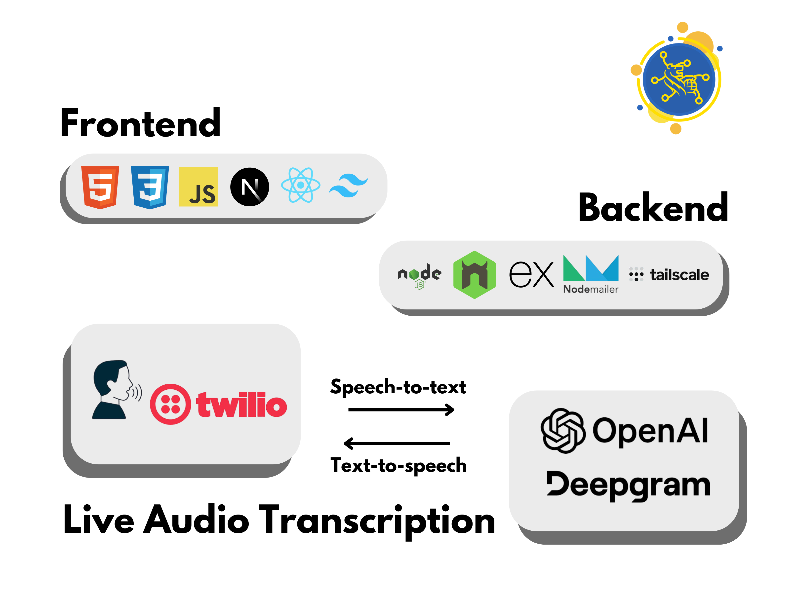

# RBveal

    

## 💡 Inspiration
In today's digital age, young adults and students are increasingly "chronically online," making them prime targets for sophisticated cyber threats like spear phishing. Where the average [click rate of spear-phishing attempts are over **50%**](https://aag-it.com/the-latest-phishing-statistics/?utm_source=chatgpt.com). Cyber attacks are projected to [cost the global economy **$10.5 trillion**](https://cybersecurityventures.com/cybercrime-damages-6-trillion-by-2021/?utm_source=chatgpt.com) by 2025. 

## 🔍 What it does
RBveal addresses the problem of cybersecurity for students by simulating real-world phishing scenarios, empowering students to recognize and respond to cyber threats, thereby safeguarding their financial information in an increasingly perilous digital landscape.  
- Multi-Stage AI-Driven simulation, simulate a phone call from a bank representative who mimics real-world phishing tactics
- An interactive learning experience for students to learn how to respond to cyber threats

## 🖥️ How we built it

**Frontend:** Next.js, React, Tailwind CSS  
**Backend:** Express.js, Node.js, Nodemailer, tailscale  
**Live Audio Transcription:** twilio, OpenAI, Deepgram

## 🤔 Challenges we ran into

One of the biggest challenges we faced was integrating Twilio to enable real-time audio streaming for a live AI conversation. Configuring the audio stream to work seamlessly with both speech-to-text and text-to-speech systems proved particularly complex, as it required precise coordination between Twilio, Deepgram, and OpenAI to maintain low-latency, real-time interaction.

## 🎉 Accomplishments that we're proud of

We are incredibly proud to have successfully built a multi-stage phishing simulation that educates students on recognizing and responding to cyberattacks. By simulating realistic scenarios, from fake emails to scam phone calls, we've created an engaging and practical tool to help students understand the tactics used by attackers and how to protect themselves in the digital world.

## 📕 What we learned

Through this project, we learned how to utilize Twilio to stream audio in real-time and integrate live audio transcription. This experience taught us the complexities of real-time communication and enhanced our skills in combining multiple APIs seamlessly.

## ⭐ What's next for RBveal

The next steps for this project include refining the AI-driven phone call interactions to make them more realistic and expanding the phishing scenarios to include social media and SMS-based attacks. Additionally, we plan to incorporate analytics to provide users with personalized feedback and enhance integration with educational platforms to reach a broader audience.